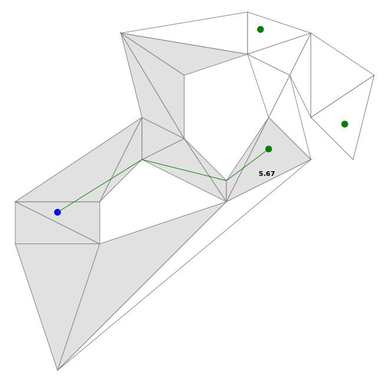

# tpastar

The _Triangulated Polygon A-star_ is a pathfinder with an ability to determine the shortest path between one starting point and multiple target points in a triangulated polygon with polygon holes.

  

The image shows the result of a pathfinding between one starting point and three target points. The shade of the triangles indicate the number of times the given triangle was expanded. In this case white means zero, grey means one expansion. 

## Licensing

This repository contains the implementation of the algorithm in C#. It is shipped with a demo application, which can be used for testing it in various arrangements. The codebase is licensed under 

## Acknowledgements
- _István Engedy_, my thesis advisor, whose support was key in the development of this project
- _Douglas Demyen_, whose master's thesis guided me this direction
- The _creators_ of the _Funnel algorithm_ on which this solution is based
- _Richard Potter_, whose library _Vector3_ was used extensively during development
- _Ákos Pfeff_ for his remarks during refactoring

---
Copyright 2017 Márton Gergó
